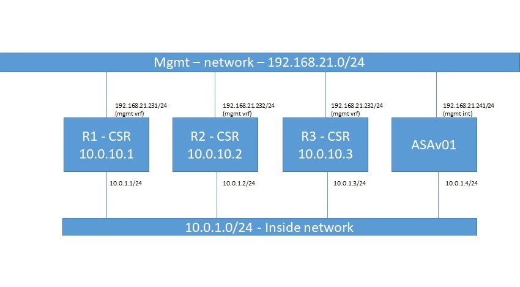

<!DOCTYPE html>
<html>
<body>
<h2>Network-automation-lab</h2>

<ul>
<li>Network automation lab consisting of 3 CSR1000v routers and 1 FW, setup in Vmware ESXi</li>
<li>Vmware ESXi</li>
</ul>

 
Current status of lab:
<ul>
<li>Router 1: 1 managment interface, 1 interface connecting to shared subnet, 1 free interface not used</li>
<li>Router 2: 1 managment interface, 1 interface connecting to shared subnet, 1 free interface not used</li>
<li>Router 3: 1 managment interface, 1 interface connecting to shared subnet, 1 free interface not used</li>
<li>Firewall 1: Cisco ASA firewall, 1 mgmt interface, 1 interface connecting to shared subnet, several free interfaces to be used</li>
</ul>

Future plans:
<ul>
<li>Automate setup with Vagrant, currently manual setup in ESXi</li>
<li>Establish some more routers for more complex scenarios</li>
<li>Establish failover pair of Cisco ASAv</li>
</ul>

</body>
</html>
