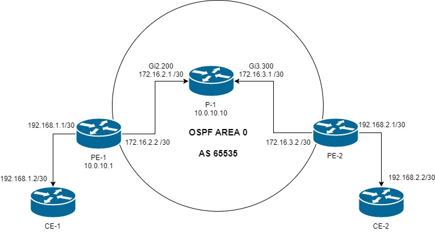

<!DOCTYPE html>
<html>
<body>
<h2>Network-automation-lab</h2>

<ul>
<li>Network automation lab consisting of 5 CSR1000v routers, setup in Vmware ESXi</li>
<li>Vmware ESXi</li>
</ul>

Future plans:
<ul>
<li>Automate setup with Vagrant, currently manual setup in ESXi</li>
<li>Establish some more routers for more complex scenarios</li>
<li>Establish failover pair of Cisco ASAv</li>
</ul>

</body>
</html>
